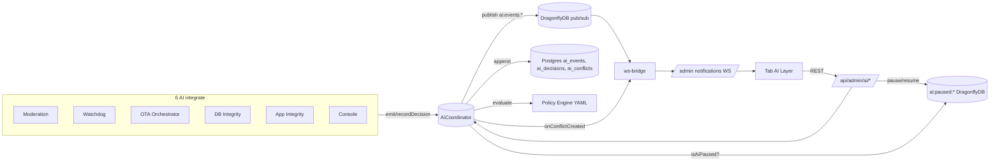

# Layer AI Coordinato — Runbook & Architettura

Task: #2657 (UI tab, governance, health dashboard, E2E).
Predecessori: #2649 (coordinator core), #2654 (6 AI integrations).

## Le 6 AI integrate (#2654)

| Nome | Ruolo | Severità tipiche |
|---|---|---|
| `moderation` | Revisione contenuti utente (post, commenti) | info / warn / critical |
| `watchdog` | Anti-abuso, anti-fraud, anti-spam | info / warn / critical |
| `ota-orchestrator` | Decide quando rilasciare un OTA bundle | info / warn |
| `db-integrity` | Verifica drift schema / orphan records | warn / critical |
| `app-integrity` | Health checks runtime (memory, latencies) | info / warn / critical |
| `console` | Logging strutturato AI-flavored | debug / info |

Il tab **AI Layer** mostra **sempre** tutte e 6, anche con zero attività (grid 6 card fissa).

## Architettura (alto livello)



## Endpoint (admin/superadmin)

| Method | Path | Scopo |
|---|---|---|
| GET | `/api/admin/ai/overview?sinceHours=24` | Stats per-AI + totali |
| GET | `/api/admin/ai/health?sinceHours=24` | Latenza, heartbeat, ratios |
| GET | `/api/admin/ai/audit?ai=&type=&severity=&kind=&from=&to=&format=json\|csv\|ndjson` | Audit filtrabile + export |
| GET | `/api/admin/ai/conflicts?open=1` | Conflitti aperti / tutti |
| GET | `/api/admin/ai/policies` | Status policy engine (versione, count) |
| GET | `/api/admin/ai/policies/yaml` | YAML sorgente + status |
| GET | `/api/admin/ai/paused` | AI/layer attualmente in pausa |
| POST | `/api/admin/ai/pause` `{aiName, reason, ttlSeconds?}` | Pausa singola AI (o `*` = layer) |
| POST | `/api/admin/ai/resume` `{aiName}` | Riattiva |
| POST | `/api/admin/ai/conflicts/:id/override` `{decision, rationale}` | Override admin (audita in `ai_decisions` con `aiName='admin'`) |
| POST | `/api/admin/ai/policies/validate` `{yaml}` | Valida senza scrivere |
| PUT  | `/api/admin/ai/policies` `{yaml}` | Scrive + reload (con backup `.bak-<ts>`) |

## Schema eventi WS (`/ws/admin/notifications`)

### `ai_event` — emesso a ogni `Coordinator.emit()`

```json
{
  "type": "ai_event",
  "payload": {
    "id": "0a3...e9",
    "aiName": "moderation",
    "eventType": "content_review",
    "payload": { "contentId": "abc", "decision": "block" },
    "severity": "critical",
    "correlationId": "req-7f1a",
    "createdAt": "2026-05-28T09:12:33.418Z"
  }
}
```

### `ai_conflict_new` — emesso a ogni `evaluateConflict()`

```json
{
  "type": "ai_conflict_new",
  "payload": {
    "conflictId": "9c2...11",
    "eventIdA": "0a3...e9",
    "eventIdB": "5b8...c4",
    "conflictType": "moderation_disagreement",
    "resolvedBy": "policy",
    "policyRuleId": "R001",
    "createdAt": "2026-05-28T09:12:33.521Z"
  }
}
```

Il client React Query invalida `["/api/admin/ai/overview"]`, `["/api/admin/ai/health"]`, `["/api/admin/ai/conflicts"]` di conseguenza (refetch < 2s end-to-end).

## Esempi di payload per AI

| AI | eventType | payload esempio |
|---|---|---|
| `moderation` | `content_review` | `{ "contentId": "p123", "decision": "block", "reason": "spam" }` |
| `watchdog` | `rate_limit_violation` | `{ "userId": "u88", "endpoint": "/api/posts", "count": 47 }` |
| `ota-orchestrator` | `rollout_decision` | `{ "channel": "ios", "fromVersion": "1.4.2", "toVersion": "1.4.3", "ramp": 0.1 }` |
| `db-integrity` | `orphan_record_detected` | `{ "table": "comments", "fk": "post_id", "count": 3 }` |
| `app-integrity` | `heartbeat` | `{ "freeMemMB": 412, "rssMB": 168, "latencyP95Ms": 87 }` |
| `console` | `decision_log` | `{ "msg": "user lookup", "userId": "u1", "ms": 12 }` |

## Adapter checklist (aggiungere una nuova AI)

1. Aggiungere il nome in `KNOWN_AIS` (`app/admin/ai-layer.tsx`) e in `KNOWN` (`server/routes/admin/ai-coordinator-governance.ts`).
2. Wrappare il punto di decisione del nuovo modulo con `coordinator.emit({ aiName, eventType, payload, severity, correlationId })`.
3. Per decisioni "stateful" (es. ban, rollback) usare `coordinator.recordDecision({ aiName, decisionType, ... })` invece di emit-only.
4. Rispettare la kill switch: **non** chiamare side-effects irreversibili prima del check `if (r.id) { ... }` (id vuoto ⇒ AI pausata).
5. Per conflitti cross-AI invocare `coordinator.evaluateConflict({ eventIdA, eventIdB, conflictType })` con un `conflictType` riconosciuto dalle policy YAML (`policies/ai-policies.yaml`).
6. Aggiungere un payload-esempio nella tabella sopra.

## Kill switch — semantica

- `ai:paused:<aiName>` in DragonflyDB con TTL configurabile (default 3600s, max 86400s).
- `ai:paused:*` blocca l'intero layer.
- `Coordinator.emit()` legge `isAiPaused(aiName)` **prima** di persistere/pubblicare:
  se in pausa l'evento è scartato e ritorna `id=""` (caller non vede errore).
- Fallback in-memory se DragonflyDB non disponibile (process-local).
- Override admin **bypassa** la pausa: il path `aiName='admin'` non viene mai bloccato.

## Override workflow

1. Conflitto resta `open` (`resolvedAt=null`) quando policy engine non lo risolve.
2. Admin apre tab "Conflitti" → clic **Override** → seleziona decisione + scrive motivazione (min 5 char).
3. Backend:
   - Inserisce `ai_decisions(aiName='admin', decisionType='conflict_override')`.
   - Aggiorna `ai_conflicts.resolvedBy='admin'`, `resolvedAt=now()`, rationale loggata.
   - Audita `ai_events(aiName='admin', eventType='override', severity='warn')`.

## Runbook operativo

### Sintomo: troppi conflitti aperti
1. Tab **Health** → controlla `% override admin` e `conflicts/decisions %`.
2. Se > 5%, apri **Policies** ed espandi regola `R001`/`R002` per coprire il pattern.
3. **Valida** → **Salva & ricarica**. Il backup `ai-policies.yaml.bak-<ts>` viene salvato accanto al file.

### Sintomo: AI impazzita / loop
1. Tab **Dashboard** → individua la card con critici/conflitti alti.
2. **Pausa** con motivo (TTL 60m). L'AI viene silenziata, le altre restano operative.
3. Indaga via tab **Audit** filtrando per `aiName=<nome>`; export CSV per analisi offline.
4. Quando risolto → **Riattiva**.

### Sintomo: degrado generale / incidente grave
1. **Kill switch Layer AI** → motivo + TTL (es. 30m). Tutte le AI sono congelate.
2. Le richieste utente continuano (le AI sono "side-channel", non bloccano flussi core).
3. Risolto → **Riattiva intero Layer**.

### Recovery post-pause
- I conflitti accumulati in pausa **non** vengono ricreati al resume (eventi scartati).
- Per ricostruire eventi storici: tooling fuori scope (#2657).

## E2E

```bash
ADMIN_USER_ID=<uuid> SESSION_COOKIE='connect.sid=...' npx tsx scripts/e2e-ai-coordinator.ts
```

Scenari (A-G):
- **A** emit + audit DB
- **B** conflict auto-resolved da policy R001/R002
- **C** override admin via HTTP → assert `resolvedBy='admin'` + nuova `ai_decisions` row
- **D** pause singola AI sopprime emit (`id=""`)
- **E** kill switch layer sopprime emit di tutte le AI
- **F** policy YAML validate (HTTP)
- **G** resilience: emit non lancia in modalità degradata

`SESSION_COOKIE` può essere omesso: gli step HTTP (C, F) vengono saltati con SKIP, gli scenari coordinator-diretti restano coperti.

## File principali

- `server/ai/coordinator/index.ts` — core + `isAiPaused/pauseAi/resumeAi/listPaused` + `onConflictCreated`
- `server/ai/coordinator/ws-bridge.ts` — subscribe `*` → broadcast WS admin (`ai_event` + `ai_conflict_new`)
- `server/routes/admin/ai-coordinator.ts` — endpoint read (#2649)
- `server/routes/admin/ai-coordinator-governance.ts` — endpoint governance (#2657)
- `app/admin/ai-layer.tsx` — UI tab (dashboard / conflicts / policies / health / audit / timeline)
- `components/admin/ai-layer/*` — card, conflicts, policies, health, timeline, kill switch, override modal, audit panel
- `hooks/admin/ai-layer/*` — React Query hooks + WS realtime
- `scripts/e2e-ai-coordinator.ts` — scenari A-G
