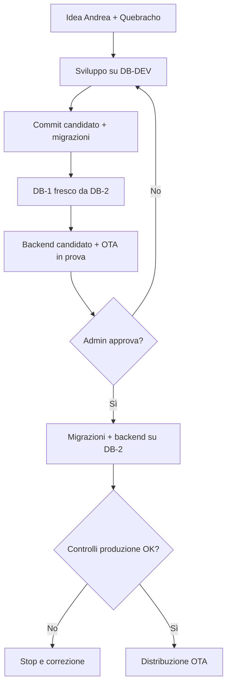
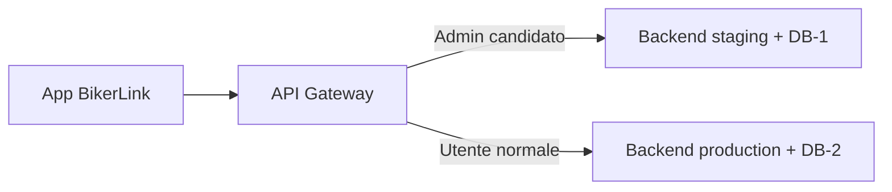

# BikerLink Release System v1.0

**Stato:** APPROVATO  
**Data:** 24 luglio 2026  
**Approvazione:** Andrea ha approvato integralmente la procedura il 24 luglio 2026  
**Ambito:** codice, database Neon/PostgreSQL, backend, EAS Build, EAS Update, pannello amministrativo e futura console Quebracho  
**Principio guida:** Andrea decide; Quebracho propone, prepara, verifica e documenta; nessuna promozione in produzione avviene implicitamente.

---

## 1. Verdetto esecutivo

La procedura concordata è valida dopo queste correzioni definitive:

1. Esiste **una sola repository BikerLink**.
2. Il codice candidato e quello approvato sono separati con branch, commit e tag Git, non con copie manuali.
3. `DB-2 PRODUCTION` è l'unica fonte autorevole dei dati reali.
4. `DB-1 CANDIDATE` è una copia sacrificabile di DB-2, creata o resettata quando serve.
5. DB-1 non viene sincronizzato continuamente, non viene fuso in DB-2 e non diventa produzione.
6. Le modifiche strutturali sono file di migrazione numerati e versionati con il codice.
7. La stessa migrazione provata su DB-1 viene applicata direttamente ai dati vivi di DB-2 dopo approvazione.
8. Backend candidato, DB-1, code, storage ed effetti esterni devono essere isolati dalla produzione.
9. Una candidata OTA viene provata dall'admin prima della distribuzione.
10. Modifiche native, Expo SDK e dipendenze native richiedono una nuova build e una nuova compatibilità runtime; non sono OTA normali.
11. Il registro delle release è unico, non branchato e indipendente dai database applicativi.
12. Ogni passaggio è singolo, verificabile, interrompibile e registrato.

La soluzione evita:

- perdita dei dati utenti;
- merge fra database divergenti;
- deploy dal database sbagliato;
- OTA incompatibili con la build;
- candidati che producono effetti reali;
- due promozioni concorrenti;
- stato OTA `pending` in un database e `approved` in un altro.

---

## 2. Architettura approvata

### 2.1 Componenti

| Componente | Funzione | Dati reali | Può essere distrutto |
|---|---|---:|---:|
| `DB-DEV` | Costruzione e test quotidiani | No | Sì |
| `DB-1 CANDIDATE` | Collaudo realistico della release | Copia temporanea | Sì |
| `DB-2 PRODUCTION` | Servizio agli utenti | Sì, autorevoli | No |
| `RELEASE CONTROL` | Stato release, approvazioni, hash e audit | Metadati release | No |
| Backend staging | Esegue il commit candidato contro DB-1 | No | Sì |
| Backend production | Esegue il commit approvato contro DB-2 | Sì | Sostituibile |
| EAS staging/candidate | Distribuzione al solo admin/tester | No | Sì |
| EAS production | Distribuzione agli utenti | Sì | No, solo promozioni controllate |

### 2.2 Flusso generale



---

## 3. Invarianti non negoziabili

Queste regole devono essere codificate nei controlli, non affidate alla memoria.

1. **Un solo proprietario dei dati reali:** DB-2.
2. **DB-1 è sempre sacrificabile:** nessun dato nato su DB-1 viene promosso in DB-2.
3. **Nessun merge di database:** si promuovono script e artefatti, non lo stato di DB-1.
4. **Nessun sync continuo:** DB-1 viene ricreato o resettato da DB-2.
5. **Una sola repository:** il candidato è una branch/commit, non una copia di cartelle.
6. **Produzione fissata a un commit:** modificare o pushare codice non modifica automaticamente produzione.
7. **Migrazioni ripetibili:** ogni variazione strutturale deve essere rappresentata da file numerati.
8. **Migrazioni immutabili dopo produzione:** un file già applicato a DB-2 non si modifica; si aggiunge una nuova migrazione correttiva.
9. **Checksum obbligatorio:** la pipeline rifiuta una migrazione applicata con contenuto differente.
10. **Un solo rilascio attivo per canale/runtime:** nessuna doppia promozione concorrente.
11. **Approva Andrea:** numero OTA, messaggio, commit, migrazioni e destinazione devono essere visibili prima dell'azione.
12. **Fallimento chiuso:** se un controllo fallisce, nulla viene distribuito agli utenti.
13. **Compatibilità temporanea:** il backend e lo schema nuovi devono supportare almeno la build/OTA precedente e quella candidata.
14. **Niente segreti nell'app:** URL con credenziali, token privati e chiavi DB restano sul server.
15. **Niente effetti esterni dalla candidata:** email, push, pagamenti, code, cron e media devono essere disattivati o isolati.
16. **Un unico registro release:** staging e produzione non mantengono copie autorevoli diverse dello stato OTA.
17. **Identità completa:** ogni release lega commit Git, migrazioni, backend, build/runtime ed EAS update/group ID.
18. **Branch non è backup:** DB-2 deve avere protezione, PITR/backup e procedura di ripristino propria.

---

## 4. Classificazione obbligatoria della modifica

Prima di lavorare, Quebracho classifica la richiesta. La classe determina il percorso.

| Classe | Esempi | DB | Backend | OTA | Nuova build |
|---|---|---:|---:|---:|---:|
| A — Solo JS/UI | testi, layout, link, logica JS senza native | No | Forse | Sì | No |
| B — Backend | endpoint, job, controlli server | No | Sì | Forse | No |
| C — DB additivo | nuova tabella/colonna/indice | Sì | Sì | Spesso | No, salvo native |
| D — Native/build | Expo SDK, plugin, permessi, libreria nativa | Forse | Forse | No come unico mezzo | Sì |
| E — Migrazione distruttiva | rinomina/elimina colonne, grandi trasformazioni | Sì, a fasi | Sì | A fasi | Forse |
| F — Emergenza sicurezza | segreto compromesso, vulnerabilità grave | Dipende | Dipende | Dipende | Dipende |

Regola: nel dubbio si sceglie la classe più restrittiva.

---

## 5. Identità e numerazione della release

Ogni candidata possiede un manifest immutabile:

```text
release_id
git_commit_sha
git_tag_candidate
app_version
android_version_code
runtime_version
ota_number
ota_label
ota_message
eas_channel
eas_update_id
eas_group_id
backend_artifact_hash
migration_list
migration_checksums
created_by
approved_by
timestamps
```

Baseline conosciuta al 24 luglio 2026:

```text
Build appVersion: 83.11.242
Android versionCode: 83
Expo SDK: 57
runtimeVersion: 11.0.0
OTA collaudata: 83.11.243
APPLIED_OTA_NUMBER: 243
EAS project: @andreamasteri/bikerlink
EAS project ID: a25192d7-72e5-46af-97d0-2d38ed9b78e3
```

Prima di pubblicare, il sistema deve mostrare ad Andrea:

- numero OTA proposto;
- versione build e runtime destinatari;
- commento pubblico;
- commit SHA;
- classe della modifica;
- necessità o meno di nuova build;
- elenco migrazioni.

Senza conferma esplicita non pubblica.

---

## 6. Procedura completa

### Fase 0 — Apertura del lavoro

1. Andrea descrive la funzione o il problema.
2. Quebracho chiarisce obiettivo, criteri di successo e rischi.
3. Viene assegnata la classe A–F.
4. Si crea una branch candidata dal commit approvato.
5. Si crea il `release_id`.
6. La pipeline acquisisce un lock: nessun'altra release dello stesso runtime può entrare in promozione.
7. Viene definito prima di scrivere codice:
   - comportamento della versione precedente;
   - compatibilità DB;
   - effetti esterni;
   - rollback client oppure fix-forward;
   - necessità di nuova build.

### Fase 1 — Sviluppo su DB-DEV

1. Quebracho prepara codice e test.
2. Le variazioni DB diventano file numerati, per esempio:

   ```text
   migrations/0150_add_new_feature.sql
   migrations/0151_fix_new_feature.sql
   ```

3. Le migrazioni vengono provate:
   - su DB-DEV già popolato;
   - su DB-DEV pulito applicando la storia dall'inizio o da una baseline certificata;
   - una seconda volta per verificare il comportamento previsto in caso di retry.
4. Si eseguono:
   - controllo TypeScript;
   - lint;
   - test unitari;
   - test API;
   - test migrazione;
   - test PostGIS se coinvolto;
   - controllo segreti;
   - controllo dipendenze.
5. Nessuna modifica manuale al DB è considerata valida finché non è rappresentata da una migrazione o da un seed versionato.
6. Codice, lockfile, migrazioni e test vengono committati insieme.

### Fase 2 — Preparazione candidata

1. DB-1 viene creato o resettato dall'ultimo stato disponibile di DB-2.
2. Si registra:
   - Neon project ID;
   - branch ID;
   - branch name;
   - parent branch ID;
   - timestamp della copia.
3. La pipeline verifica che DB-1 non sia DB-2 e che DB-2 sia la branch protetta prevista.
4. Le migrazioni candidate vengono applicate a DB-1.
5. Si confronta lo schema ottenuto con quello atteso.
6. Si distribuisce il backend staging dal commit candidato.
7. Il backend staging utilizza esclusivamente:
   - DB-1;
   - code staging;
   - storage staging/prefisso staging;
   - notifiche in modalità sink;
   - job staging o disabilitati.
8. Si eseguono smoke test automatici.
9. Andrea conferma numero OTA e messaggio.
10. La candidata viene pubblicata sul percorso di prova compatibile con build e runtime.

### Fase 3 — Prova admin

L'admin deve provare almeno:

1. installazione sopra l'OTA precedente senza cancellare dati;
2. avvio a freddo;
3. login e rinnovo sessione;
4. funzione nuova;
5. funzioni critiche preesistenti;
6. rete lenta/offline/ripresa;
7. telemetria in coda e reinvio;
8. upload media in ambiente staging;
9. chiusura forzata e riapertura;
10. ritorno all'OTA precedente o alla build incorporata;
11. verifica che nessun utente normale abbia ricevuto la candidata.

Se qualcosa fallisce:

- la candidata viene marcata `REJECTED` o `BLOCKED`;
- DB-2 non cambia;
- gli utenti non cambiano;
- DB-1 può essere corretto, resettato o distrutto;
- si crea un nuovo commit e una nuova candidata.

### Fase 4 — Collaudo finale fresco

Quando codice, DB e OTA sembrano corretti:

1. si congela il commit candidato;
2. nessun file può cambiare senza produrre un nuovo commit/release candidate;
3. DB-1 viene nuovamente ricreato dall'ultimo DB-2;
4. tutte le migrazioni candidate vengono riapplicate da zero;
5. si misurano durata, lock e righe trasformate;
6. si verificano conteggi, vincoli, indici, PostGIS e integrità;
7. si ridistribuisce il backend candidato dallo stesso commit congelato;
8. si ripetono test automatici;
9. l'admin esegue lo smoke test finale.

Questa fase impedisce che una candidata funzioni soltanto grazie a correzioni manuali accumulate su DB-1.

### Fase 5 — Approvazione per produzione

Il pannello mostra una scheda non modificabile:

| Campo | Valore richiesto |
|---|---|
| Commit | SHA completo |
| OTA | numero, runtime, EAS group/update ID |
| Build | appVersion, versionCode, EAS build ID |
| Backend | artifact hash |
| Migrazioni | nomi, ordine e checksum |
| DB sorgente test | DB-1 branch ID |
| DB destinazione | DB-2 project/branch ID |
| Ultimo test | data, esito e device |
| Ripristino | stato backup/PITR |

L'admin preme **Approva candidata**. Questo non distribuisce ancora l'OTA.

### Fase 6 — Deploy DB-2 e backend production

Il pulsante **Deploy produzione** attiva una pipeline protetta.

#### Preflight

1. Acquisizione lock esclusivo.
2. Verifica che il commit non sia cambiato.
3. Verifica checksum migrazioni.
4. Verifica esplicita dell'identità DB-2.
5. Divieto di host legacy/Helium.
6. Verifica branch Neon protetta.
7. Verifica che nessuna migrazione inattesa sia presente.
8. Verifica capacità DB, connessioni e assenza di incidenti attivi.
9. Creazione/verifica punto di ripristino.
10. Verifica compatibilità con OTA/build precedente.

#### Esecuzione

1. Applicazione delle migrazioni additive a DB-2.
2. Ogni migrazione registra:
   - versione;
   - checksum;
   - commit;
   - inizio/fine;
   - esito.
3. Le operazioni lunghe o non transazionali vengono eseguite come job separati e monitorati.
4. Verifica schema e integrità.
5. Deploy backend production dallo stesso commit/artifact approvato.
6. Smoke test backend contro DB-2.
7. Verifica che la build/OTA precedente continui a funzionare.
8. Se qualunque controllo fallisce, lo stato diventa `PRODUCTION_BLOCKED` e l'OTA non viene distribuita.

### Fase 7 — Distribuzione OTA

Solo quando lo stato è `PRODUCTION_READY` si abilita **Distribuisci OTA**.

1. Il sistema verifica nuovamente commit, runtime, EAS update/group ID e canale.
2. Viene promosso lo stesso bundle collaudato, quando la configurazione lo consente.
3. La distribuzione iniziale può essere percentuale.
4. Si monitorano:
   - crash;
   - errori API;
   - latenza;
   - errori DB;
   - login;
   - code telemetria;
   - upload media;
   - versione realmente attiva sui device.
5. Se stabile, il rollout passa al 100%.
6. La release diventa `COMPLETED`.

### Fase 8 — Chiusura

1. Creazione tag release immutabile.
2. Registrazione finale di tutti gli identificativi.
3. DB-1 viene eliminato o resettato da DB-2.
4. Branch candidata viene chiusa/archiviata.
5. Il lock viene rilasciato.
6. Le eventuali rimozioni distruttive vengono pianificate in una release successiva.

---

## 7. Regola per le migrazioni: expand → migrate → contract

Una singola release non deve normalmente eliminare ciò che serve alla precedente.

### Esempio corretto

1. **Expand:** aggiungere nuova colonna/tabella lasciando la vecchia.
2. **Dual compatibility:** backend legge vecchio e nuovo formato e scrive quanto necessario.
3. **Migrate:** backfill dei dati esistenti a lotti.
4. **Switch:** OTA nuova utilizza il nuovo formato.
5. **Observe:** attendere che le vecchie versioni non siano più rilevanti.
6. **Contract:** eliminare il vecchio formato in una release futura separata.

### Regole

- evitare `DROP`, rinomina immediata e conversioni irreversibili nella stessa release;
- utilizzare `lock_timeout` e `statement_timeout` appropriati;
- non creare grandi indici bloccanti durante traffico attivo;
- i backfill devono essere riprendibili;
- telemetria e upload devono usare ID idempotenti;
- ogni trasformazione dati deve produrre conteggi e controlli verificabili.

---

## 8. Routing della candidata: decisione architetturale necessaria

Per provare **lo stesso bundle OTA** contro DB-1 e poi promuoverlo contro DB-2, il bundle non deve incorporare una destinazione staging incompatibile con produzione.

### Soluzione raccomandata

1. L'app usa un unico dominio API stabile.
2. Un gateway riconosce una sessione admin autorizzata alla candidata.
3. Tutte le richieste di quella sessione vengono instradate al backend staging/DB-1.
4. Gli utenti normali vengono instradati al backend production/DB-2.
5. Il routing è deciso dal server sulla base di un'assegnazione firmata; non da un semplice header modificabile dal client.
6. Alla chiusura della prova, la sessione admin torna alla produzione.



### Alternativa

Una build staging separata può puntare a un endpoint staging. È più semplice da isolare, ma il bundle provato non è necessariamente identico a quello production se contiene variabili d'ambiente differenti. In quel caso si promuove lo stesso commit e si ricostruisce il bundle con configurazione production, accettando un piccolo rischio residuo.

Decisione proposta: **gateway con assegnazione server-side**, build staging separata come strumento diagnostico secondario.

---

## 9. Isolamento trasversale della candidata

La separazione del solo database non basta.

| Sistema | Regola candidata |
|---|---|
| Database | Solo DB-1 |
| Redis/cache | Namespace o istanza staging |
| Job/cron | Disabilitati o code staging |
| Push | Sink/test device, mai utenti reali |
| Email/SMS/WhatsApp | Sandbox o blocco |
| Pagamenti | Sandbox |
| Storage foto | Bucket/prefisso staging |
| Media production già referenziati | Lettura consentita se necessario; modifica/cancellazione vietata |
| AI esterne | Quota e namespace staging |
| Analytics | Ambiente staging |
| Webhook | Endpoint sandbox |
| Autenticazione | Solo admin/tester autorizzati |

Con utenti reali, DB-1 contiene una fotografia di dati personali. Accessi, durata e cancellazione del branch devono essere controllati. In futuro è preferibile l'anonimizzazione per test non svolti esclusivamente dall'admin.

---

## 10. Stato release unico

La divergenza osservata con OTA 243 dimostra che il controllo release non può dipendere da `DATABASE_URL` ambigue.

### Decisione proposta

Creare un piccolo `RELEASE CONTROL` separato e non branchato. Il pannello admin e la pipeline parlano solo con questo servizio.

Stati minimi:

```text
DRAFT
DEV_VERIFIED
CANDIDATE_DEPLOYED
CANDIDATE_TESTING
CANDIDATE_REJECTED
CANDIDATE_APPROVED
PRODUCTION_DEPLOYING
PRODUCTION_BLOCKED
PRODUCTION_READY
OTA_ROLLOUT
COMPLETED
```

Ogni transizione:

- controlla lo stato precedente;
- è atomica;
- registra attore, ora e motivazione;
- non può essere saltata;
- non può essere eseguita due volte per errore.

Variabili esplicite:

```text
DATABASE_URL_DEV
DATABASE_URL_CANDIDATE
DATABASE_URL_PRODUCTION
RELEASE_CONTROL_DATABASE_URL
```

Il processo deve fallire se trova alias generici o host legacy non autorizzati.

---

## 11. Matrice dei guasti

| Guasto | Impatto utenti | Reazione |
|---|---:|---|
| Migrazione fallisce su DB-DEV | Nessuno | Correggere prima della candidata |
| Migrazione fallisce su DB-1 | Nessuno | Distruggere/reset DB-1, correggere |
| OTA candidata non parte | Nessuno | Rifiutare; admin torna a OTA precedente/embedded |
| Backend staging non parte | Nessuno | Bloccare candidata |
| Effetto staging raggiunge produzione | Potenzialmente grave | Kill switch, isolamento obbligatorio |
| Preflight identifica DB errato | Nessuno | Fallimento chiuso |
| Migrazione DB-2 fallisce in transazione | Nessun OTA nuovo | Rollback transazione, blocco |
| Migrazione DB-2 fallisce parzialmente | Nessun OTA nuovo | Stop; fix-forward controllato |
| Backend production nuovo fallisce | Possibile impatto vecchi client | Revert backend; DB additivo resta |
| EAS indisponibile dopo deploy backend | Nessun OTA nuovo | Backend deve supportare vecchi client |
| OTA production difettosa | Alcuni utenti | Fermare rollout; ripubblicare precedente o fix-forward |
| OTA modifica stato locale incompatibile | Rollback incerto | Test downgrade; preferire fix-forward |
| Migrazione corrompe dati reali | Grave | Stop scritture; analisi PITR/forward repair |
| Due release contemporanee | Grave | Lock/concurrency impedisce l'avvio |
| Release Control indisponibile | Nessuna nuova release | Produzione continua invariata |
| Telemetria offline | Nessuna perdita prevista | Coda locale, retry e idempotenza |
| Upload media interrotto | Orfani/incompletezza | Protocollo riprendibile e cleanup |

---

## 12. Falle trasversali individuate e correzioni

### Critiche

#### 12.1 Stato OTA diviso fra database

**Evidenza nota:** OTA 243 risultava `pending` su Helium e `approved` su Neon.  
**Correzione:** Release Control unico; nessuna decisione basata su `DATABASE_URL` generica.

#### 12.2 Candidata e produzione con endpoint diversi

**Rischio:** il bundle provato può non essere quello distribuito.  
**Correzione:** dominio API stabile e routing candidato server-side; in alternativa, ricostruzione dallo stesso commit con rischio esplicitato.

#### 12.3 Modifiche DB manuali non riproducibili

**Rischio:** DB-1 funziona ma DB-2 non può essere portato allo stesso schema.  
**Correzione:** tutte le modifiche diventano migrazioni versionate; collaudo finale su DB-1 fresco.

#### 12.4 Migrazione distruttiva e vecchi client

**Rischio:** utenti con build/OTA precedente smettono di funzionare.  
**Correzione:** expand–migrate–contract e finestra di compatibilità.

#### 12.5 Effetti esterni condivisi

**Rischio:** una prova invia push, cancella foto o esegue job reali.  
**Correzione:** isolamento completo e kill switch staging.

#### 12.6 Segreto o destinazione sbagliati

**Rischio:** staging scrive su produzione o viceversa.  
**Correzione:** secret per environment, controllo project/branch ID e fallimento chiuso.

### Alte

#### 12.7 OTA usata per cambiamenti nativi

**Correzione:** classificazione A–F e guardia automatica basata su fingerprint/diff native.

#### 12.8 Due release simultanee

**Correzione:** lock unico per runtime/canale e concurrency della pipeline.

#### 12.9 Ripristino considerato sempre sicuro

**Correzione:** rollback client, backend e database sono procedure differenti. Expo avverte che lo stato persistente del device può rendere insicuro il ritorno a un'OTA precedente.

#### 12.10 Branch trattato come backup

**Correzione:** PITR/backup testato e prova periodica di ripristino.

#### 12.11 Dati personali copiati su DB-1

**Correzione:** accesso minimo, TTL, audit e successiva introduzione di branch anonimizzati.

### Medie

#### 12.12 Drift delle dipendenze

**Correzione:** lockfile obbligatorio, installazione pulita in CI e archivio SBOM/dependency report.

#### 12.13 Build e commit non correlati

**Correzione:** salvare EAS build ID, fingerprint e commit SHA nel manifest.

#### 12.14 Modifica dei file di versione non committata

**Evidenza nota:** dopo OTA 243 `constants/buildInfo.ts` e `logs/ota-hwm.txt` risultavano modificati localmente.  
**Correzione:** preparare e committare i file di versione prima della pubblicazione oppure generarli deterministicamente dal manifest, mai lasciarli come effetto collaterale non registrato.

---

## 13. Sicurezza

1. Branch Git di produzione protetta.
2. Ambiente GitHub `production` con approvazione richiesta.
3. Secret production disponibili soltanto dopo l'approvazione.
4. Un solo deployment production in corso.
5. Token EAS, Neon e hosting con privilegi minimi.
6. Rotazione e revoca documentate.
7. Nessun segreto in `EXPO_PUBLIC_*`.
8. Nessun segreto nei log.
9. MFA/passkey sugli account amministrativi.
10. Audit immutabile delle azioni admin.
11. Pulsanti production protetti da riautenticazione recente.
12. Conferma che mostri nome e ID reali del destinatario, non soltanto “DB-2”.

EAS Update supporta firma end-to-end delle OTA, ma al 24 luglio 2026 la funzione è indicata da Expo come disponibile sui piani EAS Production o Enterprise. Va quindi valutata economicamente e, se adottata, la chiave privata deve restare fuori dal repository.

---

## 14. Breve termine: prima di correggere BikerLink

Queste attività precedono nuove funzioni.

### Blocco 1 — Identità e pulizia

1. Inventario di tutti gli URL DB e loro utilizzatori.
2. Eliminazione definitiva della dipendenza operativa da Helium/Replit DB.
3. Identificazione e protezione della branch Neon production.
4. Nomi espliciti per DEV, CANDIDATE e PRODUCTION.
5. Verifica che nessun client contenga credenziali DB.

### Blocco 2 — Repository e migrazioni

1. Definire branch production/candidate.
2. Disattivare qualsiasi deploy production automatico da push generico.
3. Scegliere e certificare il migration runner.
4. Creare ledger migrazioni con checksum.
5. Convertire o inventariare le modifiche DB esistenti.
6. Rendere pulito e riproducibile lo stato Git dopo pubblicazione OTA.

### Blocco 3 — Ambienti

1. Creazione/reset automatico DB-1 da DB-2.
2. Backend staging separato.
3. Isolamento Redis, job, notifiche e storage.
4. Health check staging e production distinti.
5. Definizione routing admin candidato.

### Blocco 4 — Release Control

1. Stato unico delle release.
2. Manifest completo.
3. Macchina a stati.
4. Lock/concurrency.
5. Audit.
6. Pulsanti:
   - Prova candidata;
   - Approva candidata;
   - Deploy produzione;
   - Distribuisci OTA;
   - Ferma rollout;
   - Ripubblica precedente/embedded.

### Blocco 5 — Collaudo del sistema

1. Release senza modifiche funzionali.
2. Migrazione additiva innocua.
3. Candidata intenzionalmente fallita.
4. Backend staging fallito.
5. Preflight con DB destinatario errato.
6. Rollout parziale e arresto.
7. Ripristino OTA precedente.
8. Prova PITR/restore in ambiente non production.

Solo dopo questi test il sistema diventa il canale normale di sviluppo.

---

## 15. Lungo termine

### Prima del lancio pubblico

- monitoring crash mobile e backend;
- tracciamento versione attiva per device;
- rollout percentuale;
- test Android/iOS reali;
- test upgrade e downgrade dello stato locale;
- code offline per telemetria;
- upload media idempotente;
- restore drill periodico;
- privacy/retention dei branch;
- test di carico sul DB candidato;
- piani di indisponibilità dei fornitori.

### Con crescita degli utenti

- backend blue/green o canary;
- migrazioni online e backfill a lotti;
- feature flag server-side;
- branch anonimizzati;
- cancellazione automatica dei branch scaduti;
- approvazione a quattro occhi per produzione;
- firma OTA se sostenibile;
- gestione multi-runtime per utenti con build vecchie;
- SLO e allarmi automatici che fermano il rollout;
- disaster recovery documentato e provato.

### Da non introdurre senza necessità

- sincronizzazione continua DB-2 → DB-1;
- replica bidirezionale;
- due copie manuali del codice;
- auto-deploy production da ogni push;
- migrazioni generate direttamente dall'AI senza revisione;
- cancellazioni schema nella stessa release della nuova funzione;
- accesso diretto dell'app al database.

---

## 16. Decisioni approvate

Andrea ha approvato esplicitamente questi punti:

1. **Una repository**, con branch candidate e produzione fissata a commit/tag.
2. **DB-2 unico proprietario dei dati reali**.
3. **DB-1 temporaneo**, creato/reset da DB-2 e mai sincronizzato o promosso.
4. **Migrazioni numerate e versionate**, unica via per modificare DB-2.
5. **Collaudo finale su DB-1 fresco** prima della produzione.
6. **Release Control unico e non branchato**.
7. **Quattro gate distinti:** prova, approvazione, deploy produzione, distribuzione OTA.
8. **Routing candidato server-side** per consentire la prova dello stesso bundle contro DB-1.
9. **Expand–migrate–contract** per mantenere compatibili vecchie e nuove app.
10. **Produzione fail-closed:** un controllo fallito blocca tutto.

---

## 17. Valutazione finale

### Punti forti

- separazione netta fra costruzione, prova e produzione;
- nessuna perdita dovuta a merge di database;
- admin come autorità finale;
- candidata realmente sacrificabile;
- passaggi piccoli e osservabili;
- compatibilità con OTA e nuove build;
- crescita possibile senza riprogettazione totale.

### Debolezze residue

- il gateway candidato richiede progettazione e test accurati;
- le migrazioni esistenti potrebbero non essere ancora completamente riproducibili;
- il sistema OTA attuale ha già mostrato split-brain e working tree sporco;
- l'isolamento di storage, code e notifiche deve essere verificato nel codice reale;
- la strategia `runtimeVersion` attuale deve essere auditata prima della prossima build nativa;
- il ripristino DB non è ancora certificato finché non viene provato.

### Giudizio

**Architettura proposta: 9/10.**  
Il punto mancante non è concettuale: è la dimostrazione operativa dei controlli, delle migrazioni e del ripristino.

---

## 18. Fonti tecniche

- [Neon — Branching](https://neon.com/docs/introduction/branching)
- [Neon — Reset from parent](https://neon.com/docs/guides/reset-from-parent)
- [Neon — Protected branches](https://neon.com/docs/guides/protected-branches)
- [Neon — Backup & restore](https://neon.com/docs/guides/backup-restore)
- [Neon — GitHub Actions branching](https://neon.com/docs/guides/branching-github-actions)
- [Neon — Example E2E with Playwright](https://github.com/neondatabase/neon-playwright-example)
- [PostgreSQL — Logical replication restrictions](https://www.postgresql.org/docs/current/logical-replication-restrictions.html)
- [Expo — Deploy updates](https://docs.expo.dev/eas-update/deployment/)
- [Expo — Runtime versions](https://docs.expo.dev/eas-update/runtime-versions/)
- [Expo — Rollouts](https://docs.expo.dev/eas-update/rollouts/)
- [Expo — Rollbacks](https://docs.expo.dev/eas-update/rollbacks/)
- [Expo — Error recovery](https://docs.expo.dev/eas-update/error-recovery/)
- [Expo — End-to-end code signing](https://docs.expo.dev/eas-update/code-signing/)
- [GitHub — Deployments and environments](https://docs.github.com/en/actions/reference/workflows-and-actions/deployments-and-environments)
- [GitHub — Concurrency](https://docs.github.com/en/actions/concepts/workflows-and-actions/concurrency)
