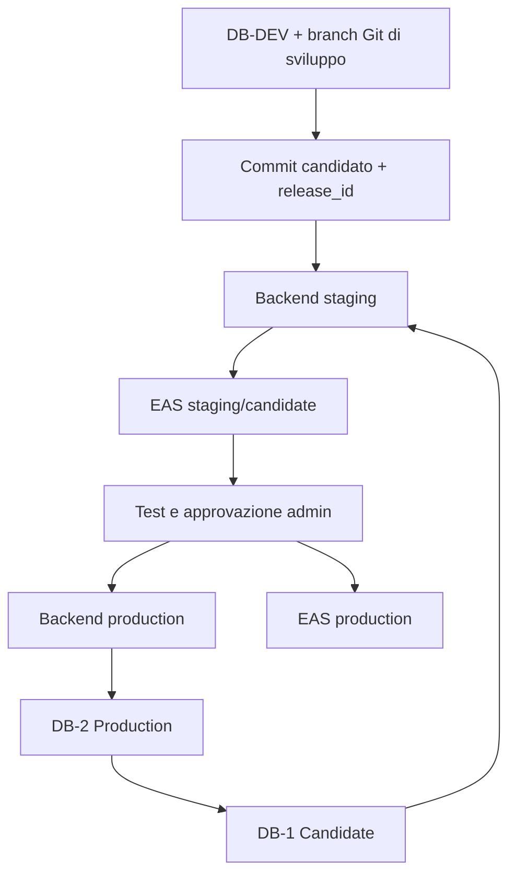

# BikerLink — Schema unico: DB, backend, build e OTA

Questo documento è la fonte operativa per le release. I dati non vengono mai
promossi da dev o candidate a produzione: si promuovono esclusivamente commit,
migration SQL, configurazione e build approvati.

## Ambienti e nomi

| Nome | Ruolo | Dati | Regola |
|---|---|---|---|
| DB-DEV | sviluppo quotidiano | sintetici/mascherati | sacrificabile |
| DB-1 Candidate | collaudo della release | copia temporanea di DB-2 | si crea per una release e poi si elimina |
| DB-2 Production | applicazione pubblica | reali | unica fonte autorevole; mai reset/copia da dev |
| Backend staging | backend candidato | usa DB-1 Candidate | solo admin/tester |
| Backend production | backend pubblico | usa DB-2 Production | utenti |
| EAS staging/candidate | OTA candidata | admin/tester | non raggiunge utenti |
| EAS production | OTA utenti | utenti | solo dopo approvazione |

## Procedura release

1. Si lavora nel branch Git e su DB-DEV.
2. Si fissa un commit candidato e un `release_id`; la pipeline viene bloccata su quella revisione.
3. Si crea DB-1 Candidate da DB-2 Production. DB-1 è temporaneo e non è mai una fonte da cui copiare dati in produzione.
4. Il backend staging usa il commit candidato con DB-1; applica e verifica le migration.
5. Smoke live: login, SSE, cleanup, stato migration, pool/errori DB.
6. Si pubblica una OTA candidate sul canale staging, riservata ad admin/tester.
7. Dopo approvazione, lo stesso commit e le stesse migration sono promossi al backend production su DB-2.
8. Verificato il backend production, si pubblica l'OTA production per gli utenti.
9. DB-1 Candidate viene eliminato secondo il TTL previsto; il `release_id` conserva l'audit.

## Vincoli

- Le migration numerate sono l'unica via per cambiare lo schema di DB-2.
- Il runner controlla `schema_migrations` nel database effettivamente raggiunto; una cache locale non può saltare tale controllo.
- `session` è una migration versionata.
- Le migration seguono expand → migrate/backfill → contract: nessuna rimozione distruttiva nella stessa release che introduce un nuovo uso.
- Modifiche native, Expo SDK o dipendenze native richiedono una nuova build APK/AAB prima dell'OTA compatibile.
- Staging/DB-1 non è ancora configurato e verificato: finché manca, non si dichiara completa una release end-to-end.

## Restore drill

Il ripristino viene provato solo su un branch temporaneo creato da un punto nel tempo scelto. La prova registra: timestamp, branch creato, migration lette, smoke e cancellazione del branch. Non si ripristina né si resetta DB-2.
